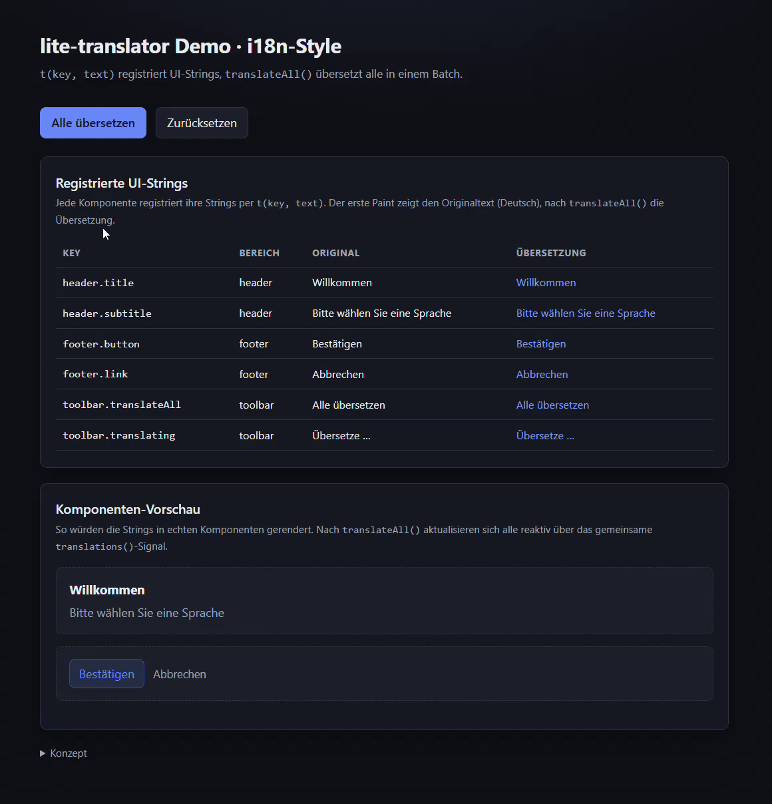
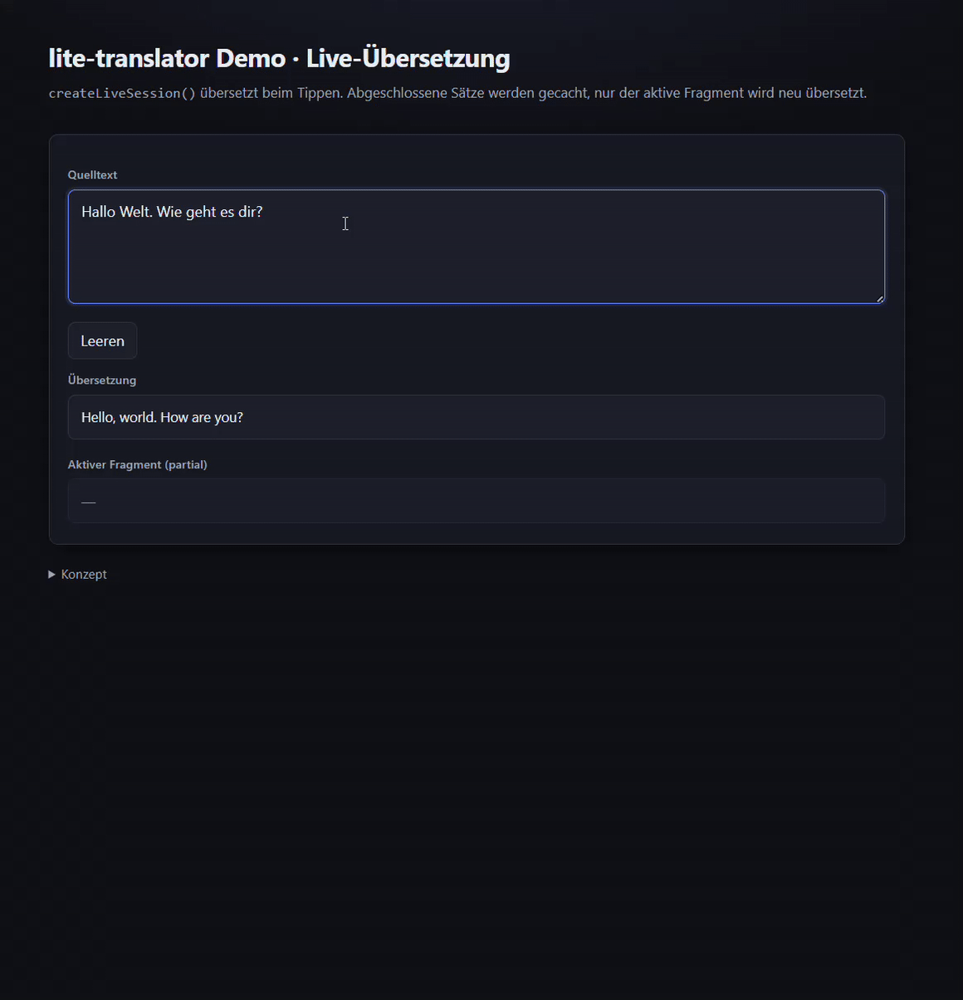
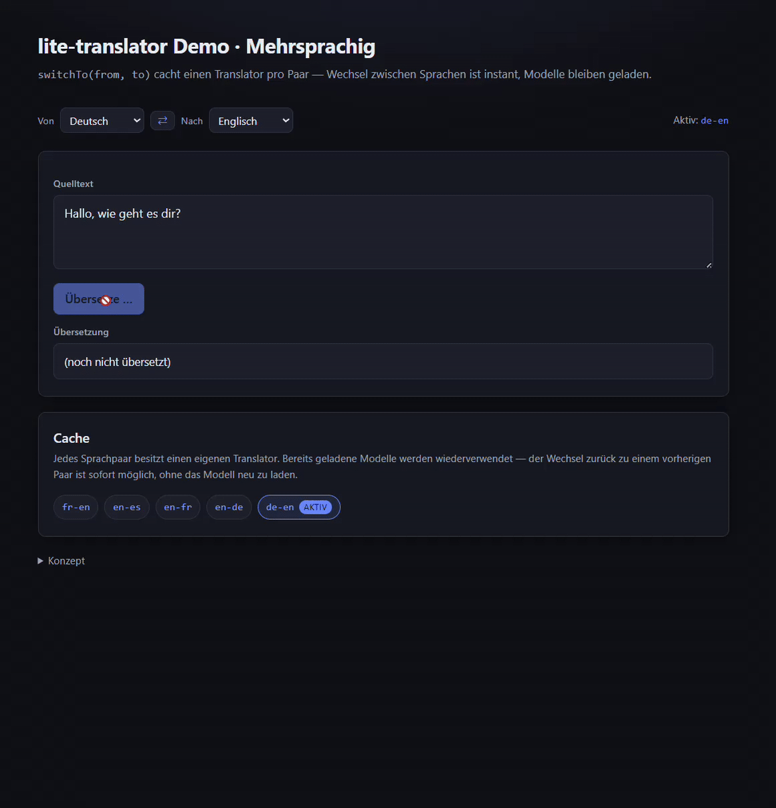

# lite-translator

Privacy-friendly, local, offline-capable translation library for the browser.
Translation text never leaves the user's device — no cloud APIs, no remote servers.

- **Core**: `@lite-translator/core` — dependency-free API + engine interface.
- **Engine**: `@lite-translator/engine-onnx` — local machine translation via Transformers.js (ONNX) in a Web Worker.

## Status

**0.1.0** — all roadmap steps through Step 13 are ✅ done.

| Capability                                              | Status |
| ------------------------------------------------------- | ------ |
| Core API + engine interface                             | ✅     |
| DE ↔ EN, FR ↔ EN, ES ↔ EN, IT ↔ EN, NL ↔ EN             | ✅     |
| Lazy loading, progress events, offline cache            | ✅     |
| Web Worker inference (UI stays responsive)              | ✅     |
| Batch translation (`translateBatch`)                    | ✅     |
| WebGPU acceleration with WASM fallback                  | ✅     |
| Live translation (incremental, debounced)               | ✅     |
| i18n-style batch translation (`t()` + `translateAll()`) | ✅     |
| Quality suite + benchmarks                              | ✅     |

See the full [Roadmap](docs/ROADMAP.md) for details and the per-step history.

## Demo

<table>
  <tr>
    <td align="center"></td>
    <td align="center"></td>
    <td align="center"></td>
  </tr>
</table>

## Install

```sh
npm install @lite-translator/core @lite-translator/engine-onnx
```

## Quickstart

```ts
import { createTranslator } from "@lite-translator/core";
import { createOnnxEngine } from "@lite-translator/engine-onnx";

const translator = await createTranslator({
  from: "de",
  to: "en",
  engines: [createOnnxEngine()],
  onProgress: (e) => console.log(e.phase, e.progress),
});

const result = await translator.translate("Hallo Welt");
console.log(result.text); // "Hello World"
await translator.dispose();
```

## Features at a glance

### Batch translation

Translate many texts in a single inference call — one tokenization, encoder
and decoder pass for the whole batch instead of N roundtrips.

```ts
const results = await translator.translateBatch(["Hallo Welt", "Guten Morgen"]);
console.log(results.map((r) => r.text)); // ["Hello World", "Good morning"]
```

### Live translation

Translate incrementally while the user types (chat) or while speech-to-text
streams words in. Input is segmented at sentence boundaries; completed
sentences are cached and only the still-growing tail is re-translated.

```ts
const live = translator.createLiveSession({ debounce: 250 });

live.on("translation", (event) => {
  console.log(event.text); // full translation
  console.log(event.partial); // still-growing tail
});

live.update("Hallo wie geht");
```

See [docs/live-translation.md](docs/live-translation.md).

### i18n-style translation

Register UI strings with `t(key, text)` across components, then translate all
of them in one `translateAll()` call — one inference pass, no race conditions.

```ts
const t = translator.t();

t("header.title", "Willkommen");
t("footer.button", "Bestätigen");

await translator.translateAll(); // 1 translateBatch → 1 inference call
t("header.title"); // → "Welcome"
```

See [docs/i18n-style-batch-translation.md](docs/i18n-style-batch-translation.md).

## Documentation

- [Roadmap](docs/ROADMAP.md) — timeline, principles, per-step status
- [API reference](docs/api.md)
- [Language selection](docs/language-selection.md)
- [WebGPU acceleration](docs/webgpu-acceleration.md)
- [Live translation](docs/live-translation.md)
- [i18n-style batch translation](docs/i18n-style-batch-translation.md)

## Integration Guides

- [HTML / Vanilla JavaScript](docs/integration-html.md)
- [React 18](docs/integration-react.md)
- [Vue 3](docs/integration-vue.md)
- [Angular 22](docs/integration-angular.md)

## License

MIT
